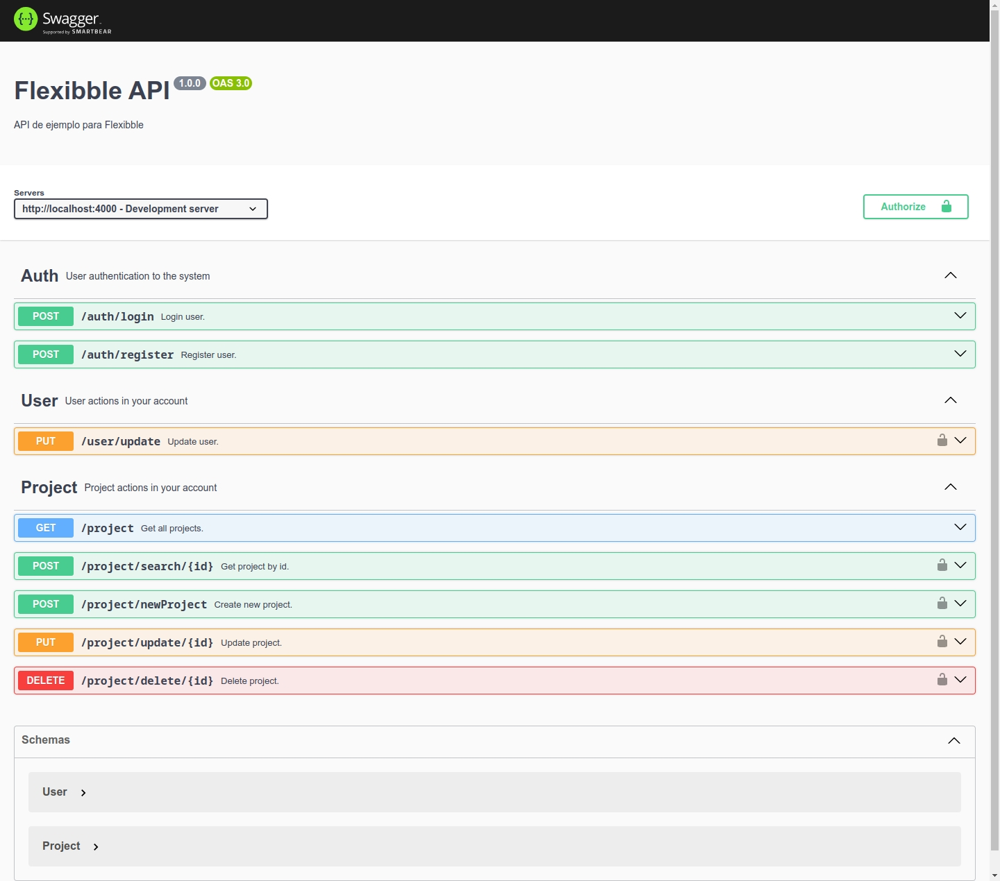

## Purpose

Rest API that allows you to manage creative projects in a dribbble-type system, display public projects of registered users.

### Begin

```bash
npm i

# or

pnpm i

# or

bun i
```

### Environment Variables

```env
PORT  =  4000

DB_URL  =  "" // MongoDB database url

JWT_SECRET  =  "" // json web token secret string

ROUTE_PROFILE  =  "/public/img/profile"

ROUTE_PROJECT = "/public/img/project"

ORIGIN_APPLICATION = "192.168.1.107" // application origin url

IP_PUBLIC_SERVER = "192.168.1.107" // server url where the api is executed
```

### Run the api

```bash
npm run dev

# or

pnpm run dev

# or

bun dev
```
